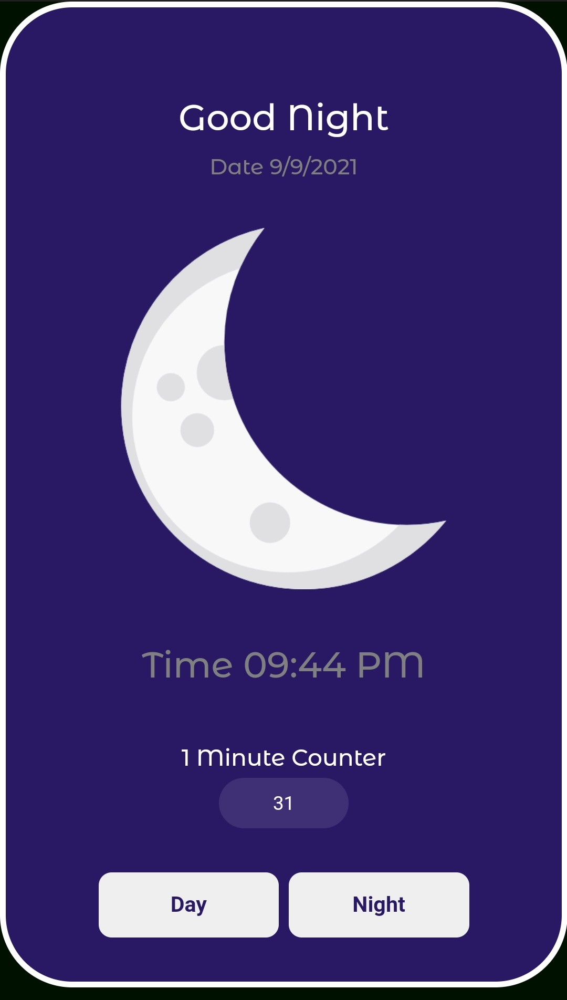

This Is A Simple Sleep Track App UI
Developed In HTML,CSS,JavaScript
 # Features
 [+] Current Date  
 [+] Current Time  
 [+] Day/Night Mode  
 [+] Different Wishes For Day&Night  
 [+] Image Changing  
 [+] One Minute Counter  
 
# Screenshots

